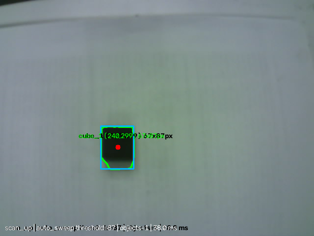
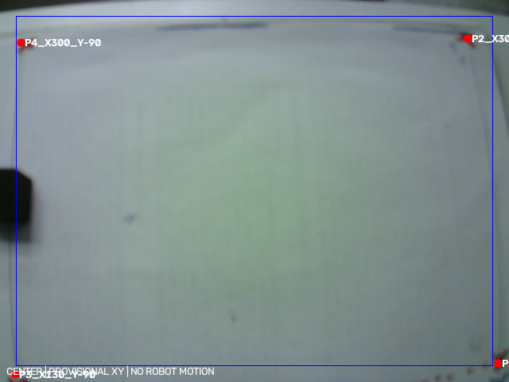
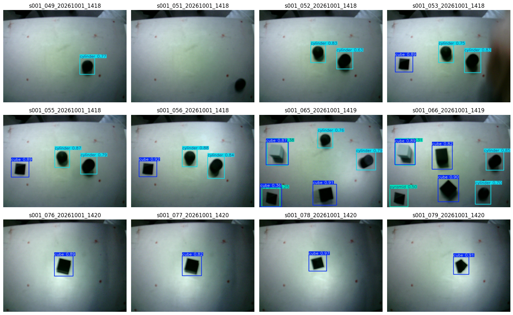
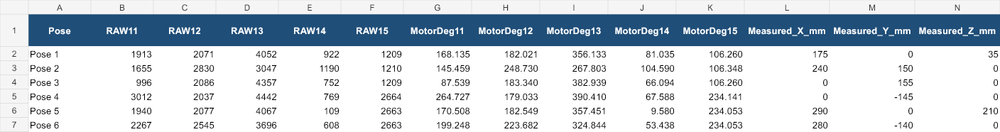
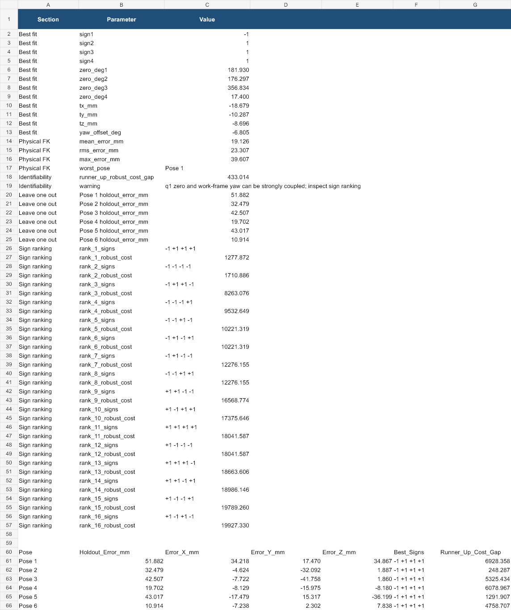
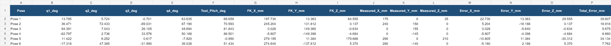
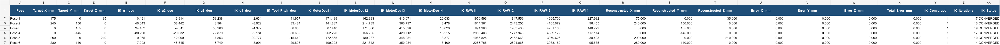

# OpenMANIPULATOR-X project report

**ISU XR LAB · 4 October 2026 · Europe/Istanbul**
**Documented period:** 26 August–2 October 2026. The first commit in this repository is dated 27 August; the 26 August controller work is preserved in the local project history. This is a retrospective of the available evidence, not a claim that every experiment or hardware step succeeded.

## Executive summary

We built an OpenCR/DYNAMIXEL controller and Python desktop application for the OpenMANIPULATOR-X, added Cartesian teaching and replay, calibration checks, repeatability logging, supervised camera-assisted pick/place, gamepad control, and a staged vision pipeline. Offline kinematic and application checks passed in several phases. Physical accuracy, a safe autonomous grasp cycle, and live deployment of the latest YOLO model remain unproven. The distinction matters because encoder-based FK and offline IK can be correct while the gripper misses the physical target.

The repository records source and selected illustrations. Raw camera datasets, run logs, checkpoints, model weights, generated results, and packaged executables are kept local. Dates below are local experiment timestamps where available; Git dates show publication or source milestones rather than the time of each physical test.

## Dated timeline

| Date (2026) | Work and evidence | Outcome / limit |
|---|---|---|
| **26–27 Aug** | Developed HOME-path and trajectory-limit recovery ideas for the gravity-loaded arm; first repository commit `4b942b6` on 27 Aug. | Source-level work; no verified board compile or physical endpoint recovery for that early sketch. |
| **1–2 Sep** | Built the initial Python/OpenCR controller (`openmanipulator_project`), serial commands, FK/IK, joint constraints, and Cartesian teach/replay. Recorded a full workbook and an XYZ-only replay workbook. | Python checks passed; replay deliberately uses XYZ and recomputes IK. Initial firmware upload was not established by those checks. An ID12 `TARGET_NOT_REACHED` observation required motor/load investigation. |
| **7–10 Sep** | Rebuilt calibration around measured motor RAW readings, added manual OpenCR read/move diagnostics, FK/IK verification, and a stable trajectory snapshot dated 10 Sep. | RAW values remain the measurement source. Mathematical round trips do not establish physical TCP accuracy. |
| **12 Sep** | Imported the existing workspace to GitHub with one-file commits, then added trajectory code, tests and workbook verification (`04428de`). | Published source history; the workspace root itself is not a Git checkout. |
| **14–15 Sep** | Added automatic repeatability sampling, speed/settling controls, separate result workbooks, plots, and GUI diagnostics (`ba74620` through `334171b`). | Logging supports encoder-based tracking analysis. Experimental logs and workbooks were held out of later source-only pushes. |
| **18–22 Sep** | Selected the USB camera, wrote a no-motion camera test, evaluated an OpenCV black-cube baseline, and captured a 34-frame 640×480 pilot on **22 Sep**. V3 CSV starts **21 Sep 19:10 +03:00**. | One annotated example below reports center `(240,299)` px. The 34-frame pilot was for annotation readiness, not a trained detector. |
| **20–23 Sep** | Integrated experiment controls/live plots (`70906c3`), developed scan/preview geometry, and saved annotated scan overlays on **23 Sep**. | Images show visual landmarks; pixel-to-robot mapping and camera mounting still need physical validation. |
| **25 Sep** | Added supervised camera pick/place UI, route checks and diagnostics (`05c3e24`, `df70e8a`). Built a separate F710 → Python bridge → OpenCR Cartesian/gamepad path. | Pick/place is supervised; gripper RAW endpoints/current cutoff, clearance and actual grasp need measurement. F710 sketch was not confirmed compiled/uploaded or physically tested. |
| **28 Sep–1 Oct** | Added gripper/gamepad protocol and MOTOR/XYZ jogging (`3da992d`, `c4ddfc6`); the calibration/controller offline suite reported **51 tests OK**. Investigated the physical Z=0 gap. | A nominal Z=0 is not ground contact. Final settled RAW and finger-center ground gap are the next measurements before changing tool offset. |
| **30 Sep–2 Oct** | Prepared a separate YOLO26 live preview, real-camera fine-tuning materials, and digit-classifier dataset/notebook work (`be23a77`, `ac286fd` on 2 Oct). The real-camera image manifest records **1 Oct** captures. | The YOLO fine-tune validation is development-only; live camera inference and independent held-out performance were not established. Digit work is a separate research branch, not robot grasp proof. |

## System built

The main path is **Python GUI → USB serial → OpenCR → DYNAMIXEL IDs 11–14**, with ID15 gripper support in the later protocol. The OpenCR implementation uses `Dynamixel2Arduino`, `Serial3`, direction pin 84, protocol 2.0 and a 1,000,000 baud bus. The GUI exposes robot connection/torque, experiments, logs, camera/scan, pick/place and gamepad controls. The [main project README](../openmanipulator_repeatability_project/README.md) documents the current UI and motion settings; the [initial controller README](../openmanipulator_project/README.md) records the earlier system.

Calibration keeps encoder RAW, motor angle, mathematical joint angle, and finger-center TCP distinct. The remounted robot's straight raised reference is documented as ID11–14 RAW `(1917, 2046, 4049, 0)`. The later WORK pose is about `(179.668, 0, 47.023)` mm at the finger-center TCP in the configured model. These are model values, not independently measured ground coordinates. The provisional XYZ envelope and IK/joint checks are software guards, not a certified physical workspace.

Cartesian teaching stores joint readings for analysis but replays only `trajectory_xyz.xlsx` through IK. The repeatability workflow samples actual encoder readings, writes per-point XYZ error and motor-angle workbooks, and plots trends. The documented camera-payload profile limits speed and lengthens settle/touch sampling. Its `2°` warning is diagnostic; the separate `10°` stop remains the hard tracking threshold in that experimental configuration. See the [repeatability data guide](../openmanipulator_repeatability_project/REPEATABILITY_DATA_GUIDE.md).

Supervised pick/place uses camera-derived X/Y with operator-entered pick, place and travel Z. It checks reachability before motion, but neither IK nor a camera box proves free space, cube height, grasp force or safe contact. Documented examples show that changing destination Y can make a route mathematically reachable, while a separate ID11 `TARGET_NOT_REACHED` is a physical tracking failure. The [pick/place experiment record](../PICK_PLACE_EXPERIMENT.md) preserves those cases and the no-retry abort behavior.

## Vision and model data

The V3 OpenCV log has **73 detection rows** across its recorded tests; these rows are detections, not 73 independent scenes. On 21 Sep at 19:10:03 +03:00 the annotated capture found one cube at center `(240,299)` px, measured about `67×87` px, with a threshold of `87` and processing time `38.025 ms`. This is one local scene under its then-current lighting and pose, not an accuracy benchmark.

The 22 Sep pilot manifest contains **34 images** at 640×480 from camera index 1 in the `one_cube_scan_up_01` session. The camera was described as `fixed_rigid` for that capture, with reported motor angles `170.156, 161.895, 333.896, 125.420°`; the mount/setup must still be rechecked before using those frames for geometry. A 23 Sep scan overlay illustrates the saved landmark display; its text explicitly says no robot motion.

The shape research audited two external datasets: **2,760** colored-block images and **220** robotic-arm images. The colored-block set has only a source training split, mixed polygon/box labels and many near-duplicate candidates; a grouped derived split was proposed. The robotic-arm source has 192 train, 19 validation and 9 test images, with no cylinder in its nine-image test set. Those audits are recorded locally in `YOLO26 shape detection/analysis/dataset_analysis_report.md`; source images are not republished here.

The later camera fine-tune configuration records seed 42, 60 epochs, 640-pixel images and batch 8. Its **24-image development validation** reports precision `0.6009`, recall `0.8825`, mAP50 `0.7633`, mAP50–95 `0.5005` at confidence `0.25`. These are from `validation_scores.json`, not an independent camera deployment test. The local prediction gallery preview below shows examples; it does not itself prove live performance.

The `camera_yolo26_preview.py` path was prepared for a no-motion live trial with class names, confidence and saved frames. Checkpoint integrity and script syntax were checked; the earlier attempted device indices did not produce the requested live frames. The camera index and the exact Python environment must be rechecked. Vision output remains separate from motion until real-camera labels and positions are visually confirmed.

## Calibration and verification figures

The retained verification plots document the calibration workbook and offline FK/IK analysis. They show model consistency, not measured physical ground contact.

The offline calibration record reports an exact J1 RAW conversion round trip and 213 randomized FK→IK→FK reconstructions below `1e-6 mm`. The later GUI/controller suite reported 51 passing tests. These numbers validate calculations and code paths only. The reported physical symptom was that the gripper remained above ground at nominal Z=0. Before changing calibration, measure the settled finger-center TCP-to-ground gap and record all final motor RAW values at the same pose. The current [calibration README](../calibration_rebuild/README.md) contains the manual reading workflow.

## Current status and remaining gates (4 October 2026)

| Area | Confirmed | Remaining |
|---|---|---|
| Repository and software | Source, docs, workbooks and selected plots are in Git; offline suites passed at the recorded milestones. | Re-run checks after any firmware/calibration change. |
| Arm motion | Controller and safety checks are implemented; some real `TARGET_NOT_REACHED` readings were observed. | Diagnose motor/load/settling and confirm board firmware/limits against the actual robot. |
| TCP calibration | Model and RAW conversion documented. | Measure ground gap and settled RAW; verify independent physical TCP points. |
| Repeatability | Encoder sampling, workbook outputs and plots implemented. | Conduct controlled physical repetitions and compare with independent TCP measurements. |
| Camera/shape | OpenCV scene evidence, 34-frame pilot, dataset audit and development YOLO scores. | Re-establish live camera preview, assess an independent held-out real-camera set, calibrate camera-to-robot geometry. |
| Pick/place and F710 | Supervised UI/bridge and offline route checks implemented. | Measure ID15 endpoints/current and clearance; compile/upload matching firmware; perform a supervised physical trial. |

## Evidence index and dating method

- **Git dates and publication:** `git log` on `main`; earliest commit 27 Aug, selected milestones above through 2 Oct. A commit date is a repository event, not proof of a test run that day.
- **Experiment timestamps:** local `data/opencv_tests_v3/opencv_test_results_v3.csv`, `dataset/raw/capture_manifest.csv`, and `data/vision_scan_logs/`. Representative images were copied into `docs/report_assets/` for this public report; complete local raw datasets remain outside the repository.
- **Model figures:** local `YOLO26 shape detection/camera_finetune_results V1/validation_scores.json`, `train_config.json`, split manifest and preview gallery. Only the curated preview image is included here.
- **Technical source:** linked READMEs, [kinematics research](../OpenMANIPULATOR_X_IK_FK_Practical_Research_and_Lessons.md), [trajectory analysis](../openmanipulator_repeatability_project/POINT_EXPERIMENT_ENGINEERING_ANALYSIS.md), [pick/place record](../PICK_PLACE_EXPERIMENT.md), and tracked calibration plots.

**Conclusion:** By 4 October, the project has a substantial working software and experiment framework with documented offline evidence. Its next defensible milestone is a small supervised physical calibration and live-camera validation, followed by measured grasp/repeatability trials. No autonomous end-to-end pick/place claim is made from the available records.
